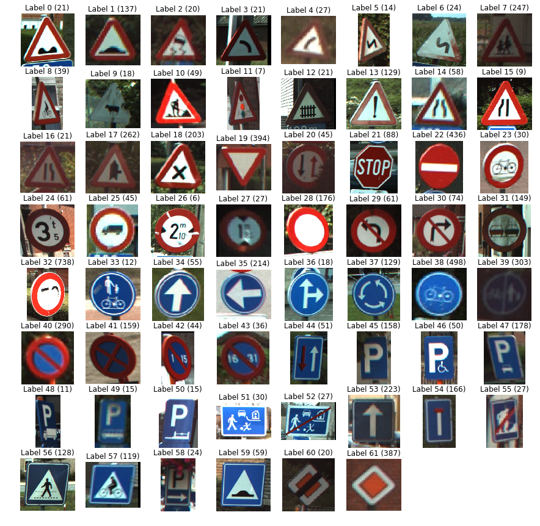
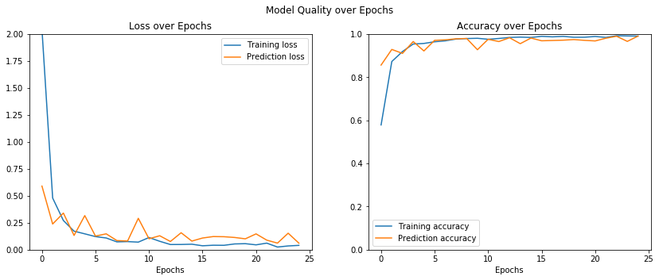

# Exercise 3 Machine Learning Lab

## Exercise c: Image classification of traffic signs

Full Code:  
https://github.com/thomashon/ml-ue3/blob/master/ue3-thomas-honeder/3c.ipynb


### Case:



### Model:

```python
model_6 = Sequential()

model_6.add(Conv2D(32, kernel_size=3, input_shape=(28, 28, 3), activation='relu', padding='same'))
model_6.add(BatchNormalization())
model_6.add(Conv2D(32, kernel_size=3, activation='relu', padding='same'))
model_6.add(BatchNormalization())
model_6.add(MaxPool2D(2))
model_6.add(Dropout(0.2))

model_6.add(Conv2D(64, kernel_size=3, activation='relu', padding='same'))
model_6.add(BatchNormalization())
model_6.add(Conv2D(64, kernel_size=3, activation='relu', padding='same'))
model_6.add(BatchNormalization())
model_6.add(MaxPool2D(2))
model_6.add(Dropout(0.3))

model_6.add(Conv2D(128, kernel_size=3, activation='relu', padding='same'))
model_6.add(BatchNormalization())
model_6.add(Conv2D(128, kernel_size=3, activation='relu', padding='same'))
model_6.add(BatchNormalization())
model_6.add(MaxPool2D(2))
model_6.add(Dropout(0.4))

model_6.add(Flatten())
model_6.add(Dense(62, activation='softmax'))
```

### Training:


